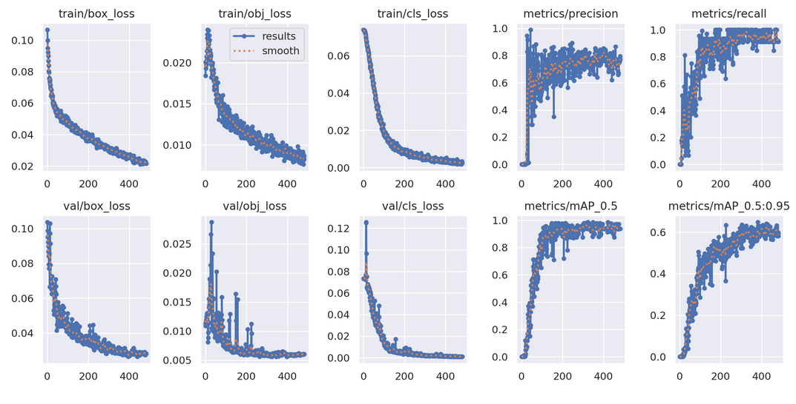
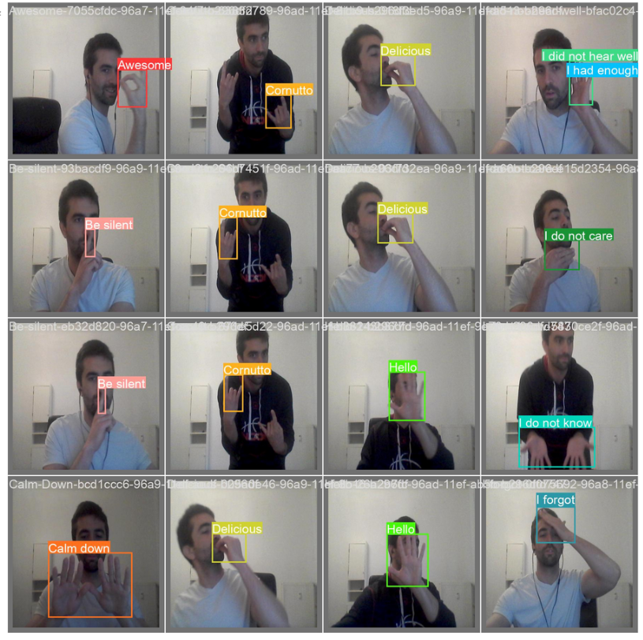

# GestoAI: An Italian Gesture Recognition Model using YOLOv5 for Real-Time Object Detection with Computer Vision

GestoAI is an object detection model designed to recognize and interpret Italian hand gestures using the YOLOv5 architecture. This project aims to capture the richness of Italian nonverbal communication by identifying and classifying distinct hand gestures in real-time. By leveraging advanced computer vision, GestoAI has potential applications in cross-cultural communication, interactive education, and immersive experiences, bringing the expressive nature of Italian gestures into digital spaces.

## Resources Used

**Platform**: Google Colab

**Packages**: cv2, uuid, os, time

**Pretrained model**: YOLOv5 from Ultralytics

**Datasource**: Pictures of myself taken with my webcam

## Image Collection

240 images representing 17 distinct Italian hand gestures were taken, being this gestures the following: Awesome, Be Silent, Calm Down, Delicious, Cornutto, Hello, I Cannot Stand You, I Did Not Hear Well, I Don’t Know, I Forgot, I’ve Had Enough, I Hope So, Let’s Go, Oh Please, Pay Attention to That, and This Person Is Such a Talker.
A sample of one of each pictures in to be found in this repo.

## Model Configuration

The code was ran in Google Colab because it offers GPU for free (until a certain limit of usage) which makes the training way faster. 
The model used was the YOLOv5 from Ultralytics, which nneded to be adapted to 17 classes to match it with the dataset.

Two models were trained, with 100 and 500 epochs an batches of 16 images.

## Results

The performance of the model with 500 epochs is really good. To break it down:

* Precission: 0,796
* Recall: 0,911
* mAP50: 0,979 which is excellent considering that the dataset only has 240 pictures and 17 classes. This metric means represent the accuracy with a 50% threshold.
* mAP50-95 is 0.648 (the model has some difficulty with precise bounding box predictions at higher thresholds, which is expected)

By class, there are some differences. Classes like awesome and lets go have lower precision scores, suggesting the model struggles with false positives for these categories while Delicios, Hello and I had enough show very high recall (1), meaning the model consistently detects instances of these classes when they are present. 

The two following pictures portray, how different metris vary depending on the number of epochs and real predictions of the dataset. 

